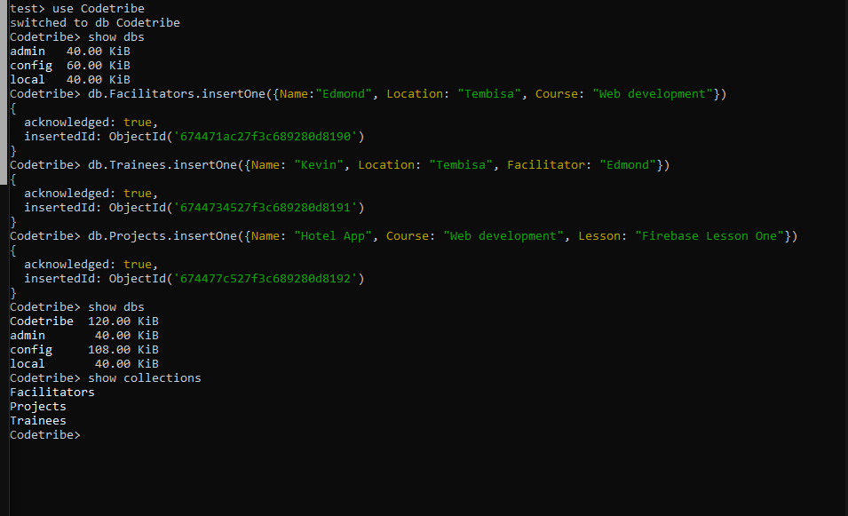
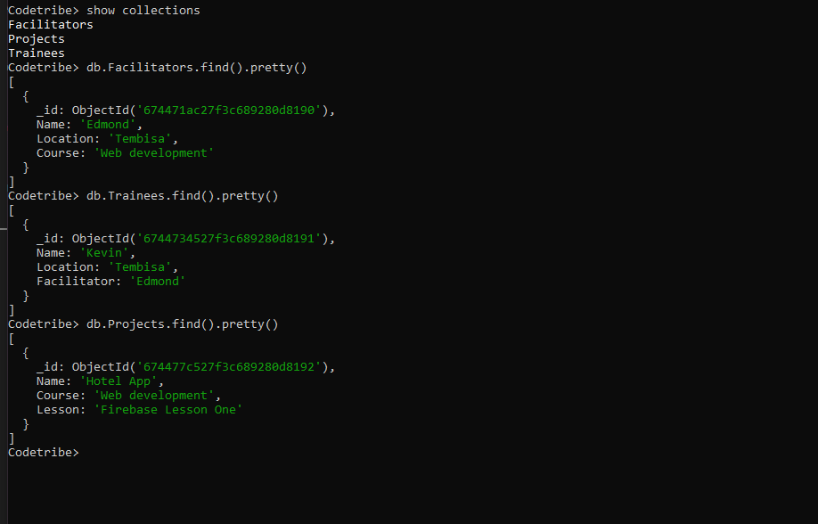

CODETRIBE DATABASE MONGO

## Description
1. ## Create the Database
You'll run this line on

Mongosh
  ```bash
  use Codetribe
  ```

2. ## Create the Facilitators Collection
Insert a document into the Facilitators collection:
 db.Facilitators.insertOne({
      Name: "Kevin",
      Location: "Tembisa",
      Course: "Full Stack Development"
  })

3. ## Create the Trainees Collection
Insert a document into the Trainees collection:
  db.Trainees.insertOne({
      Name: "Jack",
      Location: "Tokyo",
      Facilitator: "Edmond"
  })

4. ## Create the Projects Collection
Insert a document into the Projects collection:
 db.Projects.insertOne({
      Name: "Hotel App",
      Course: "Full Stack Development",
      Lesson: "Firebase Lesson One"
  })

## Media Screenshots  
  

## Verifying the Data
 use the following commands:
View all documents in the Facilitators collection:
      ```bash
      db.Facilitators.find().pretty()
      ```

View all documents in the Trainees collection:
      ```bash
     db.Trainees.find().pretty()
      ```

View all documents in the Projects collection:
     ```bash
     db.Projects.find().pretty()
     ``` 

## Media Screenshots     
  